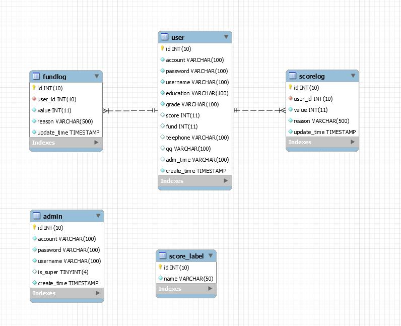

## 解决项目依赖问题
### 通过 requirements.txt 文件安装依赖包 
```
pip install -r requirements.txt
```

### 生成 requirements.txt 文件的方法
#### 方法一，该项目使用的是该方法
```
pip install pipreqs
pipreqs ./
```
#### 方法二
```
pip freeze > ./requirements.txt
```

## 项目部署

### 创建数据库
```
mysql -uroot -p123456
CREATE DATABASE score;

# 切换到 score 根目录下，执行以下命令
python manage.py deploy
```

### 插入测试数据
```
mysql -uroot -p123456

```

## 项目启动
```
# 切换到 score 根目录下，执行以下命令
python manage.py run
```


## 数据库
### ER 图



'INSERT INTO score_label(name) VALUES ("论文");',
'INSERT INTO score_label(name) VALUES ("工具");',
'INSERT INTO score_label(name) VALUES ("报告");',
'INSERT INTO score_label(name) VALUES ("发票");',
'INSERT INTO score_label(name) VALUES ("活动");',
'INSERT INTO score_label(name) VALUES ("迟到");',
'INSERT INTO score_label(name) VALUES ("早退");',
'INSERT INTO score_label(name) VALUES ("缺勤");',
'INSERT INTO score_label(name) VALUES ("其他");',
